\newpage

LICENSE

Notes for the course Objects-Oriented Programming 
Copyright © 2021 Francesco Ranellucci

Permission is hereby granted, free of charge, to any person obtaining
a copy of this software and associated documentation files (the "Software"),
to deal in the Software without restriction, including without limitation
the rights to use, copy, modify, merge, publish, distribute, sublicense,
and/or sell copies of the Software, and to permit persons to whom the
Software is furnished to do so, subject to the following conditions:

The above copyright notice and this permission notice shall be included
in all copies or substantial portions of the Software.

THE SOFTWARE IS PROVIDED "AS IS", WITHOUT WARRANTY OF ANY KIND,
EXPRESS OR IMPLIED, INCLUDING BUT NOT LIMITED TO THE WARRANTIES
OF MERCHANTABILITY, FITNESS FOR A PARTICULAR PURPOSE AND NONINFRINGEMENT.
IN NO EVENT SHALL THE AUTHORS OR COPYRIGHT HOLDERS BE LIABLE FOR ANY CLAIM,
DAMAGES OR OTHER LIABILITY, WHETHER IN AN ACTION OF CONTRACT,
TORT OR OTHERWISE, ARISING FROM, OUT OF OR IN CONNECTION WITH THE SOFTWARE
OR THE USE OR OTHER DEALINGS IN THE SOFTWARE.


\newpage

# Objects

```java
Vector v1 = new Vector();
Vector v2 = new Vector();
v1.sort();
v1.search(22);
```

# Classes

```java
public class Car {

  //attributes

  String color;
  String brand;
  boolean turnedOn;

  //methods

  void turnOn() {
    turnedOn = true;
  }
  void paint (String newCol) {
    color = newCol;
    printState
  }
  void printState () {
    System.out.println(Car + brand + color);
    System.out.println(the engine is +(turnedOn? on : off));
  }
}
```

# Constructor

```java
class Car {

  // Default constructor, creates a red Ferrari

  public Car(){
    color = "red";
    brand = "Ferrari";
  }

  // Constructor accepting the brand only

  public Car(String carBrand){
    color = "white”;
    brand = carBrand;
  }

  // Constructor accepting the brand and the color

  public Car(String carBrand, String carColor){
    color = carColor;
    brand = carBrand;
  }
}
  //===============================================

class Automobile {

  private String targa = new String();
  private String modello = new String();
  private int posto_assegnato;
  private int numero_giorni;

  public Automobile(String t, String mm, int p, int ng) {
    this.targa = t;
    this.modello = mm;
    this.posto_assegnato = p;
    this.numero_giorni = ng;
  }
}
```

# Getters and Setters


```java
{
  public String getTarga() {
    return targa;
  }
  public void setTarga(String targa) {
    this.targa = targa;
  }
  public String getModello() {
    return modello;
  }
  public void setModello(String modello) {
    this.modello = modello;
  }
}
```

# ToString

```java
{
	@Override
	public String toString() {
		return "Esercizio [codice=" + codice + ", descrizione=" + descrizione + "]";
	}
}
```

# General syntax

## Array

```java
{
  int a[] = {10, 20, 30, 40, 50, 60, 70, 80, 90, 100};
  int aa[] = new int [100];

  aa[0] = 3;
  int x = aa[1];

  System.out.println("print array");
  for (int i=0; i<a.length; i++){
    System.out.println(a[i]);
  }
  System.out.println("done");

  //string

  String stringhe[] = new String[10];
  stringhe[0]= "Primo";
  stringhe[1]= "Secondo";
  stringhe[2]= "Terzo";
  ...

  for (int i=0; i<stringhe.length; i++){
    System.out.println(stringhe[i]);
  }
}
```

## if

## for

### Iterator Collection

```java
Collection<Person> persons = new LinkedList<Person>();

for(Iterator<Person> i = persons.iterator(); i.hasNext(); ) {
  Person p = i.next();
  System.out.println(p);
}
```

```java
Collection persons = new LinkedList();

for(Iterator i= persons.iterator(); i.hasNext(); ) {
  Person p = (Person)i.next();
}
```

```java
Collection<Person> persons = new LinkedList<Person>();

for(Person p: persons) {
  System.out.println(p);
}
```

## while 

## do-while

# Inheritance

## Extends

```java
{
  class Employee{
    String name;
    double wage;
    void incrementWage(){…}
  }
  class Manager extends Employee{
    String managedUnit;
    void changeUnit(){…}
  }
  Manager m = new Manager();
  m.incrementWage(); // OK, inherited

  class Employee{
    private String name;
    public void print(){
      System.out.println(name);
    }
  }
  class Manager extends Employee{
    private String managedUnit;
    public void print(){ //overrides that in Employee
      System.out.println(name); //un-optimized!
      System.out.println(managedUnit);
    }
  }

  Employee e1 = new Employee();
  Employee e2 = new Manager();
  e1.print();
  e2.print();
}
```

## Visibility

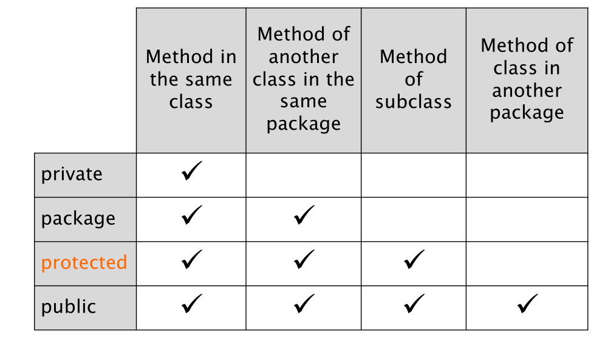{width=70%}

## Super and This

- this is a reference to the current
object
- super is a reference to the parent
class

```java
class Car {

  String color;
  boolean isOn;
  String licencePlate;

  void paint(String color) {
    this.color = color;
  }

  void turnOn() {
    isOn=true;
  }
}

class ElectricCar extends Car{
  boolean cellsAreCharged;

  void recharge() {
    cellsAreCharged = true;
  }

  void turnOn() {
    if( cellsAreCharged )
      super.turnOn();
  }
}

```

```java
class Employee {
  private String name;
  private double wage;
  Employee(String n, double w){
    name = n;
    wage = w;
  }
}

class Manager extends Employee {
  private int unit;
  Manager(String n, double w, int u) {
    super(n,w); // ok
    unit = u;
  }
}
```

# polymorphism

- Polymorphism: allows feeding algorithms with
different objects
- Dynamic binding: allows accommodating different
behavior behind the same interface

```java
Car myCar;
myCar = new Car();
myCar = new ElectricCar();

Car[] garage = new Car[4];
garage[0] = new Car();
garage[1] = new ElectricCar();
garage[2] = new ElectricCar();
garage[3] = new Car();

for(int i=0; i<garage.length; i++){
  garage[i].turnOn();
}

for(Car a : garage){
  a.turnOn();
}
```

References of type Object play a role similar to void* in C  

```java
Object [] objects = new Object[3];
objects[0] = "First!”;
objects[2] = new Employee("Luca","Verdi");
objects[1] = new Integer(2);
for(Object obj : objects){
  System.out.println(obj);
}
```

## Casting

```java
float f;
f = 4.7; // legal
f = “string”; // illegal
Car c;
c = new Car(); // legal
c = new String(); // illegal
```

```java
class Car{};
class ElectricCar extends Car{};
Car c = new Car();
ElectricCar ec = new ElectricCar ();

class Car{};
class ElectricCar extends Car{};
Car a = new ElectricCar ();
```

### Upcast

```java
Car c = new Car();
ElectricCar ec = new ElectricCar();
c = ec;
```

#### Upcast to Object

```java
AnyClass foo = new AnyClass();
Object obj;
obj = foo;
```

### Downcast

```java
Car c = new ElectricCar(); // implic. upcast
c.recharge(); // wrong!
// explicit downcast
ElectricCar ec = (ElectricCar)c;
ec.recharge(); // ok

Car c = new Car();
ElectricCar ec;
if (c instanceof ElectricCar ){
  ec = (ElectricCar) c;
  ec.recharge();
}
```

## Abstract class

## Abstract modifier

## Interfaces

```java
Interface implements Car

Class implements Car

Class implements Comparable<Car>

```

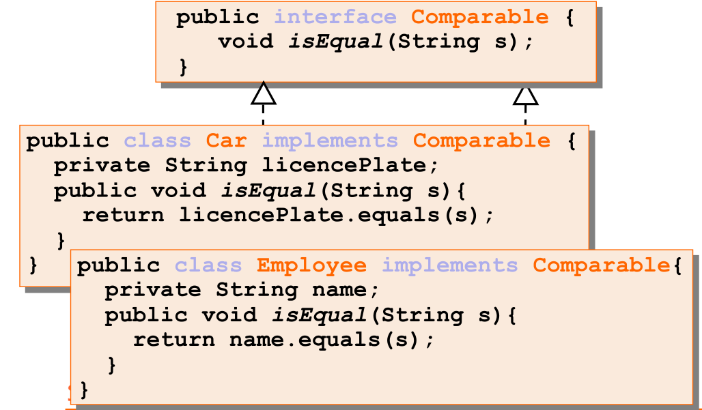{width=70%}

# Generic Class

```java
public class Person<T> {
  String first;
  String last;
  T ID;
  Person(String first,String last,T ID){
    this.first = first;
    this.last = last;
    this.ID = ID;
  }
  T getID(){ return ID; }
}
```

```java
Person<Integer> a = new Person<Integer> ("Al","A",new Integer(123));
Person<String> b = new Person<String> ("Pat","B","s32");

Integer id1 = a.getID();
String id2 = b.getID();
Integer ids = b.getID();
```
## Generic List

```java
public interface List<E>{
  void add(E x);
  Iterator<E> iterator();
}
public interface Iterator<E>{
  E next();
  boolean hasNext();
}
```

# Useful Functions

## compareTo

## sort

##

# Collection

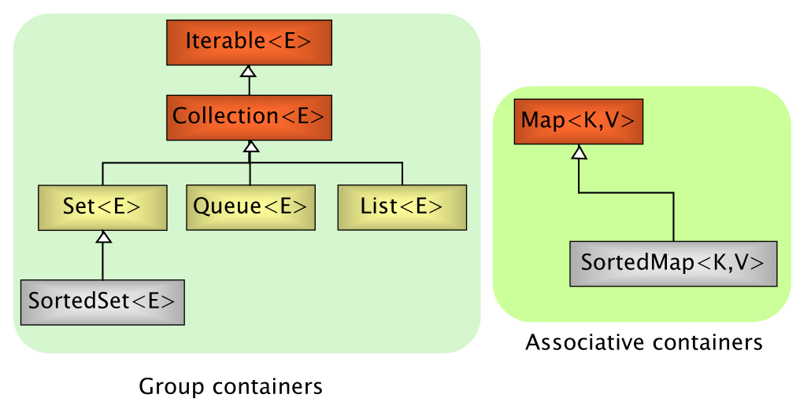{width=70%}

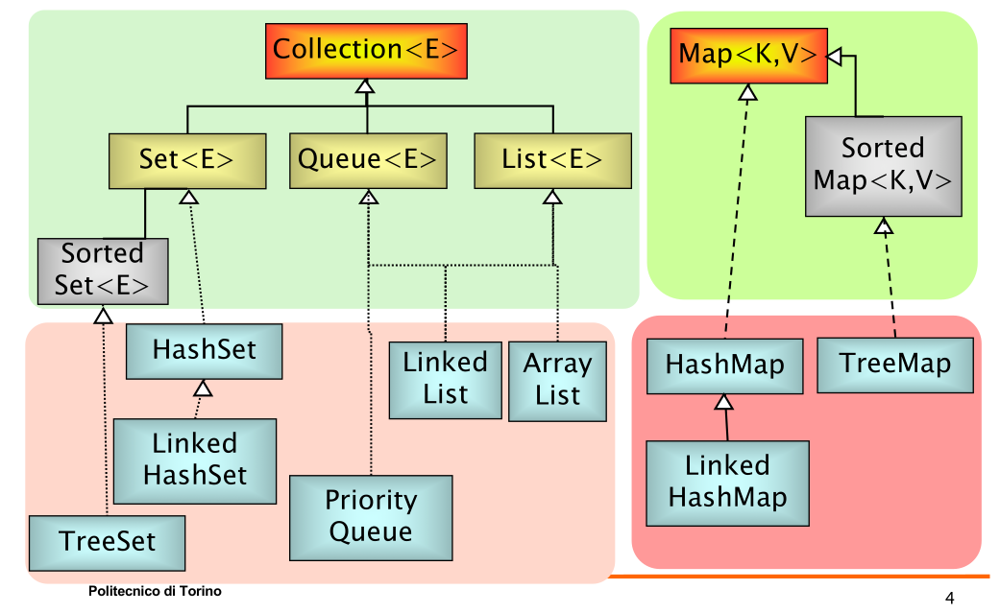{width=70%}

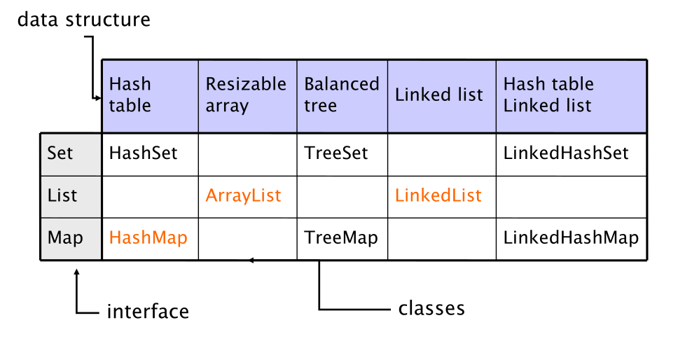{width=70%}

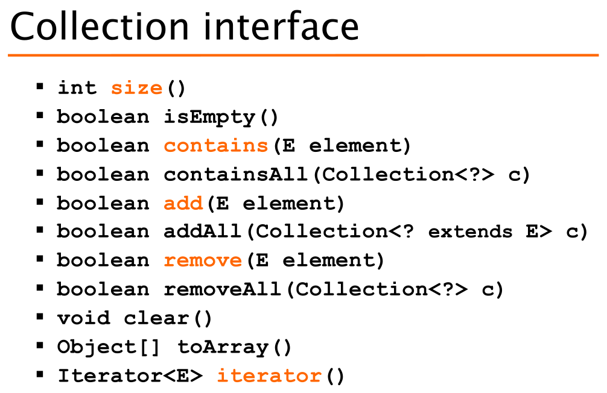{width=70%}

\newpage

```java
Collection<Person> persons = new LinkedList<Person>();

persons.add( new Person(“Alice”) );

System.out.println( persons.size() );


Collection<Person> copy = new TreeSet<Person>();

copy.addAll(persons);// new TreeSet(persons)

Person[] array = copy.toArray();

System.out.println( array[0] );
```
\newpage

## List

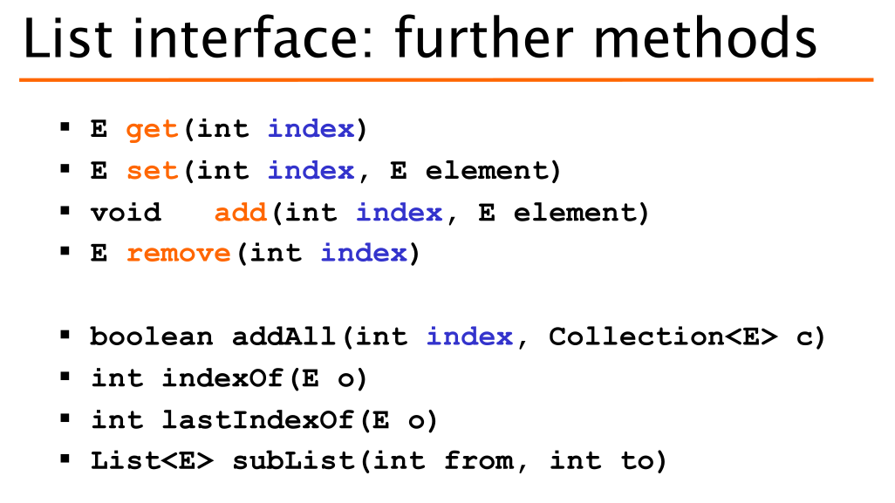{width=70%}

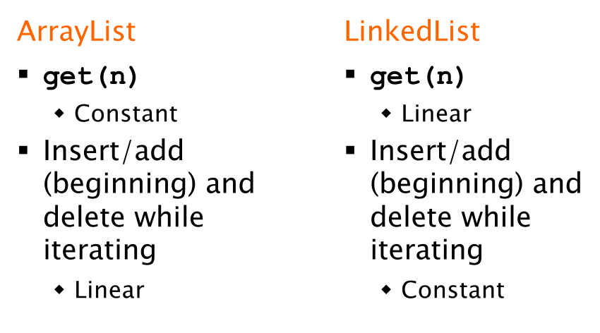{width=70%}

\newpage
### LinkedList

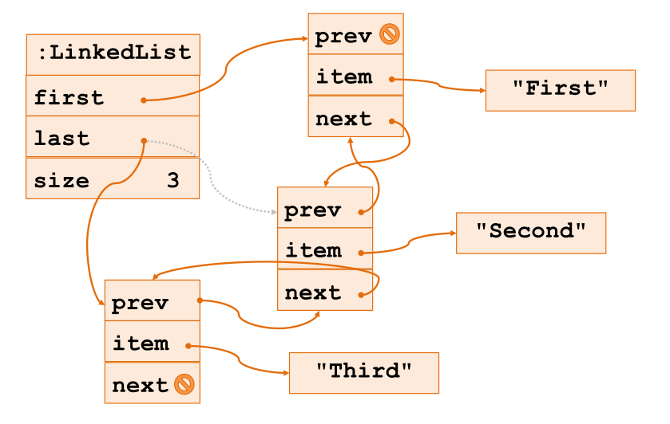{width=70%}

```java

LinkedList<Integer> ll = new LinkedList<Integer>();

ll.add(new Integer(10));
ll.add(new Integer(11));

ll.addLast(new Integer(13));
ll.addFirst(new Integer(20));
```

```java
List<Car> garage = new ArrayList<Car>(20);

garage.set( 0, new Car() );
garage.set( 1, new ElectricCar() );
garage.set( 2, new ElectricCar() );
garage.set( 3, new Car());

for(int i; i<garage.size(); i++){
  Car c = garage.get(i);
  c.turnOn();
}
```

```java

List l = new ArrayList(2); // 2 refs to null

l.add(new Integer(11));    // 11 in position 0
l.add(0, new Integer(13)); // 11 in position 1
l.set(0, new Integer(20)); // 13 replaced by 20
l.add(9, new Integer(30)); // NO: out of bounds
l.add(new Integer(30));    // OK, size extended
```
\newpage

### ArrayList

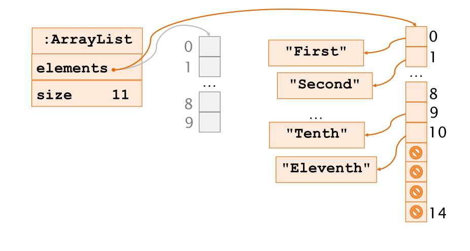{width=70%}

\newpage


### Queue

Queue implementations
- LinkedList
  - Head is the first element of the list
  - FIFO: Fist-In-First-Out
- PriorityQueue
  - Head is the smallest element

```java
Queue<Integer> fifo = new LinkedList<Integer>();
Queue<Integer> pq = new PriorityQueue<Integer>();

fifo.add(3); pq.add(3);
fifo.add(1); pq.add(1);
fifo.add(2); pq.add(2);

System.out.println(fifo.peek()); // 3
System.out.println(pq.peek()); // 1
```
\newpage

### Set

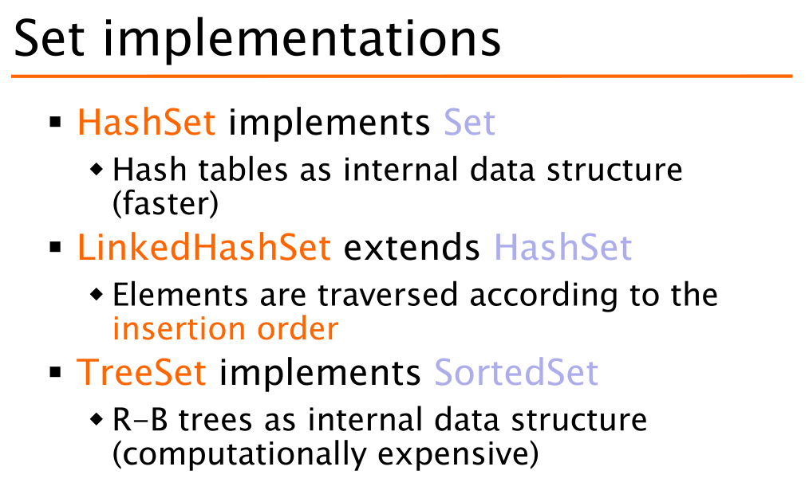{width=70%}

\newpage

### Delete

```java
List<Integer> lst=new LinkedList<Integer>();

lst.add(new Integer(10));
lst.add(new Integer(11));
lst.add(new Integer(13));
lst.add(new Integer(20));

int count = 0;
for (Iterator<?> itr = lst.iterator(); itr.hasNext(); ) {
  itr.next();
  if (count==1) 
    itr.remove(); // ok
  count++;
}
```

\newpage

### Add

```java
List lst = new LinkedList();

lst.add(new Integer(10));
lst.add(new Integer(11));
lst.add(new Integer(13));
lst.add(new Integer(20));

int count = 0;
for (Iterator itr = lst.iterator(); itr.hasNext(); ) {
  itr.next();
  if (count==2)
    itr.add(new Integer(22)); // ok
  count++;
}
```

## Map

```java
Map<String,Person> people = new HashMap<String,Person>();

people.put( “ALCSMT”, /*ssn*/ new Person(“Alice”, “Smith”) );
people.put( “RBTGRN”, /*ssn*/ new Person(“Robert”, “Green”) );

Person bob = people.get(“RBTGRN”);
if( bob == null )
  System.out.println( “Not found” );
  int populationSize = people.size();
```

### SortedMap

### HashMap

```java
Map<String,Student> students = new HashMap<String,Student>();

students.put(“123”, new Student(“123”,“Joe Smith”));

Student s = students.get(“123”);

for(Student si: students.values()){

}
```
#### Iteration
```java
Map<String,Person> people = new HashMap<String,Person>();

Collection<Person> values = people.values();

for(Person p: values) {
  System.out.println(p);
}
```

#### Print all key

```java
Map<String,Person> people = new HashMap<String,Person>();

Collection<String> keys = people.keySet();
for(String ssn: keys) {
  Person p = people.get(ssn);
  System.out.println(ssn + " - " + p);
}
```

### TreeMap

# Algorithms

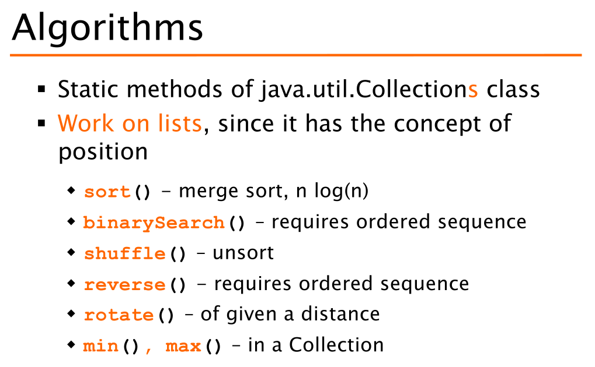{width=70%}

## Compare

```java
class StudentIDComparator implements Comparator<Student> {
  public int compare(Student s1, Student s2){
    return s1.getID() - s2.getID();
  }
}
```


## Sort

```java
List students = new LinkedList();

students.add(new Student(“Mary”,“Smith”,34621));
students.add(new Student(“Alice”,“Knight”,13985));
students.add(new Student(“Joe”,“Smith”,95635));

Collections.sort(students); // sort by name
Collections.sort(students, new StudentIDComparator()); // sort by ID
```

## Search

> Binary search


# Exception

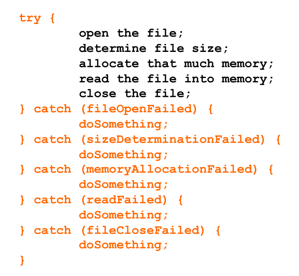{width=70%}

- Java provides three keywords
  - Throw
    - Raises (generate) an exception
  - Try
    - Introduces code to watch for exceptions
  - Catch
    - Defines the exception handling code
  - Java also defines a new type
    - Throwable (and Exception)

1. Identify/Define an exception class
2. Declare/Mark the method as potential source of exception
3. Create an exception object
4. Throw upward the exception

________________________________________________________________  

```java
// java.lang.Exception
public class EmptyStack extends Exception {

}
class Stack<E>{
  public E pop() throws EmptyStack {

    if(size == 0) {
      Exception e = new EmptyStack();
      throw e;
    }
  }
}
```
________________________________________________________________  
```java
try {
  // in this piece of code some
  // exceptions may be generated
  stack.pop();
  ...
}
catch (StackEmpty e) {
  // error handling
  System.out.println(e);
  ...
}
```
__________________________________  

```java
class Dummy {
  public void foo() throws FileNotFound{
    FileReader f;
    f = new FileReader(“file.txt”);
  }
}
```
__________________________________  
```java
class Dummy {
  public void foo() throws FileNotFound {
    try{
      FileReader f;
      f = new FileReader(“file.txt”);
    } catch (FileNotFound fnf) {
      // handle fnf, e.g., print it
      throw fnf;
    }
  }
}
```

# I/O files

## Read a char

```java
int ch = r.read();
char unicode = (char) ch;

System.out.print(unicode);
r.close();
```
## Read a char

```java
public static String readLine(Reader r) throws IOException{

    StringBuffer res= new StringBuffer();
    int ch = r.read();
    if(ch == -1) return null; // END OF FILE!
    while( ch != -1 ){
      char unicode = (char) ch;
      if(unicode == '\n') break;
      if(unicode != '\r’)
        res.append(unicode);
      ch = r.read();
    }
    return res.toString();
  }
```

## Copying a text file

```java
import java.io.*;
public class Copy {
  public static void main(String[] args) throws IOException{
    File inputFile = new File("in.txt");
    File outputFile = new File("out.txt");
    FileReader in = new FileReader(inputFile);
    FileWriter out = new FileWriter(outputFile);
    int c;
    while ((c = in.read()) != -1)
      out.write(c); // One char at a time, inefficient
    in.close();
    out.close();
  }
}
```

_______________________________________________

```java
import java.io.*;
public class Copy {
  public static void main(String[] args) throws
    IOException{
      FileReader in = new FileReader("in.txt");
      FileWriter out = new FileWriter("out.txt");
      int c;
      while ((c = in.read()) != -1)
        out.write(c); // One char at a time, inefficient
      in.close();
      out.close();
    }
}
```


## Copying a text file with buffer

```java
import java.io.*;
public class Copy {
  public static void main(String[] args) throws
    IOException{
      FileReader in = new FileReader("in.txt");
      FileWriter out = new FileWriter("out.txt");
      char[] buffer = new char[4096];
      int n;
      while ((n = in.read(buffer)) != -1)
        out.write(buffer, 0, n);
      in.close();
      out.close();
    }
}
```

# Stream

- Arrays
  - Stream<T> stream()

  ```java
  String[] s={"Red", "Green", "Blue”}.Arrays.stream(s).forEach(System.out::println)
  ```

- Stream of
  - static Stream<T> of(T... values)

  ```java
  Stream.of("Red", "Green", "Blue”).forEach(System.out::println);
  ```

- Collection
  - Stream<T> stream()
  ```java
  Collection<Student> oopClass = new LinkedList<>();

  oopClass.add(new Student(100,"John","Smith"));
  oopClass.stream().forEach(System.out::println);
  ```
_______________________________________________


```java
//map
List number = Arrays.asList(2,3,4,5);
List square = number.stream().map(x->x*x).collect(Collectors.toList());

//filter
List names = Arrays.asList("Reflection","Collection","Stream");
List result = names.stream().filter(s->s.startsWith("S")).collect(Collectors.toList());

//sorted
List names = Arrays.asList("Reflection","Collection","Stream");
List result = names.stream().sorted().collect(Collectors.toList());

//collect
List number = Arrays.asList(2,3,4,5,3);
Set square = number.stream().map(x->x*x).collect(Collectors.toSet());

//foreach
List number = Arrays.asList(2,3,4,5);
number.stream().map(x->x*x).forEach(y->System.out.println(y));

//reduce
List number = Arrays.asList(2,3,4,5);
int even = number.stream().filter(x->x%2==0).reduce(0,(ans,i)-> ans+i);
```

### Example

```java
//a simple program to demonstrate the use of stream in java
import java.util.*;
import java.util.stream.*;

class Demo {
  public static void main(String args[]) {

    // create a list of integers
    List<Integer> number = Arrays.asList(2,3,4,5);

    // demonstration of map method
    List<Integer> square = number.stream().map(x -> x*x).collect(Collectors.toList());
    System.out.println(square);

    // create a list of String
    List<String> names = Arrays.asList("Reflection","Collection","Stream");

    // demonstration of filter method
    List<String> result = names.stream().filter(s->s.startsWith("S")).collect(Collectors.toList());
    System.out.println(result);

    // demonstration of sorted method
    List<String> show = names.stream().sorted().collect(Collectors.toList());
    System.out.println(show);

    // create a list of integers
    List<Integer> numbers = Arrays.asList(2,3,4,5,2);

    // collect method returns a set
    Set<Integer> squareSet = numbers.stream().map(x->x*x).collect(Collectors.toSet());
    System.out.println(squareSet);

    // demonstration of forEach method
    number.stream().map(x->x*x).forEach(y->System.out.println(y));

    // demonstration of reduce method
    int even = number.stream().filter(x->x%2==0).reduce(0,(ans,i)-> ans+i);

    System.out.println(even);
  }
}
```

# Example codes

